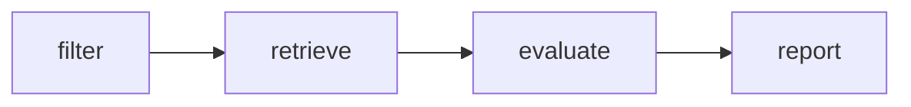

# Type 2 Diabetes Trial Pre-Screening Agent

AI-powered **pre-screening** assistant for matching synthetic patients to recruiting Type 2 diabetes trials. Built for the Froncort take-home: a small, explainable **LangGraph** pipeline (4 nodes), not a production clinical system.

## Quick start

```bash
cd trial-prescreening-agent
python -m venv .venv
.venv\Scripts\activate          # Windows
pip install -r requirements.txt
```

Run without an API key (deterministic rule-based criterion modules):

```bash
set USE_LLM=0
python src/main.py --patient_id P03 --output output/sample_patient_03_report.json
```

Optional LLM mode (Google Gemini):

```bash
copy .env.example .env
# set GEMINI_API_KEYS=...
python src/main.py --patient_id P-2715
```

Run tests and evals:

```bash
pytest tests/
python evals/run_evals.py
```

Patient ids: use dataset ids (`P-2715`) or shorthand (`P03` = 3rd patient in the file).

## Architecture

Four LangGraph nodes (fixed):

1. **filter** — recruiting status (`RECRUITING`, `ENROLLING_BY_INVITATION`), then age vs trial min/max (null boundary = open).
2. **retrieve** — field lookup snippets for the five criteria (no vector DB).
3. **evaluate** — single node looping `criteria/` modules (age, hba1c, medications, egfr, recruiting).
4. **report** — pure Python ranking (max 3 trials); **clinical fit score** and **recruiting status** stay separate.



## Repository Structure

```text
.
├── data/
│   └── Type2-Diabetes-Trial-Agent-Dataset.json
├── evals/
│   ├── cases/              # Modular test cases
│   ├── original_metric.py  # Evidence Traceability Completeness metric
│   ├── results.md          # Automated eval log
│   └── run_evals.py        # Main eval suite runner
├── output/                 # Generated JSON reports
├── src/
│   ├── criteria/           # Evaluator logic (age, egfr, hba1c, meds, recruiting)
│   ├── models/             # Pydantic schemas (Trial, Patient, CriterionEvaluation)
│   ├── nodes/              # LangGraph nodes (filter, retrieve, evaluate, report)
│   ├── utils/              # Loaders and Gemini API client
│   ├── graph.py            # LangGraph pipeline definition
│   └── main.py             # CLI entrypoint
├── tests/                  # Pytest unit tests
├── AI_USAGE.md             # Disclosure of AI tools used
├── README.md               # Setup and overview
└── RESEARCH.md             # Design choices and data mapping details
```

## Design choices

- **Vertical slice over breadth**: one patient per run, at most three ranked trials, traceable `evidence_ids` on every criterion object.
- **UNKNOWN by default for missing data** — no guessing SUPPORTED/NOT_SUPPORTED when labs or meds are absent.
- **Dual age handling**: deterministic age pre-filter plus explicit age criterion evaluation on survivors (assignment requirement).
- **USE_LLM=0** for reproducible tests/evals; LLM structured output is optional when `GEMINI_API_KEYS` is configured.
- **Out-of-scope eligibility** (pregnancy, BMI, language, etc.) flagged via `clinical_fit_summary` / trial-level review notes, not silent drops.
- Trials containing at least one confirmed NOT_SUPPORTED criterion are excluded from the recommendation list before ranking and scoring. These excluded trials are not currently surfaced in the report output; they are filtered silently. Exposing rejected trials together with the evidence supporting their exclusion would be a natural future enhancement, but was intentionally left out to keep the report focused on actionable recommendations.

## Known limitations

- Exclusion-criteria detection in `criteria/egfr.py` relies on the literal string 'exclusion criteria' in the eligibility text, and `criteria/hba1c.py` relies on a fixed keyword list (interfere, accuracy, disorder, dyscrasia, hemolysis, sickle cell). Trials phrasing these clauses differently may not trigger the safety fallback and could be misparsed. This is a known limitation of the current heuristic-based parser, not a guarantee of full exclusion-clause coverage across all 36 trials.
- Medication and HbA1c parsing uses keyword/threshold heuristics on eligibility excerpts — complex trial text often returns `REQUIRES_CLINICAL_REVIEW`.
- `CONFLICTING_EVIDENCE` for HbA1c is triggered by a fixed variance threshold across readings, without accounting for elapsed time between them. This is a known simplification.
- Sex, location, and comorbidity rules in trials are not auto-evaluated.
- Frozen ClinicalTrials.gov snapshot; status can drift in the real world.
- Not validated for clinical use; human review is mandatory.

## Evaluation

- `evals/run_evals.py` — 10+ cases (retrieval, criterion states, graph behavior, dataset coverage).
- **Original metric**: Evidence Traceability Completeness (ETC) in `evals/original_metric.py` — measures share of criterion results with non-empty `evidence_ids` (baseline: micro-average presence rate; see file for failure hypothesis and limitations).
- Evaluation results are recorded in `evals/results.md` after each evaluation run.

## Disclaimer

Synthetic data only. Output is a **pre-screening aid**, not an eligibility determination.
